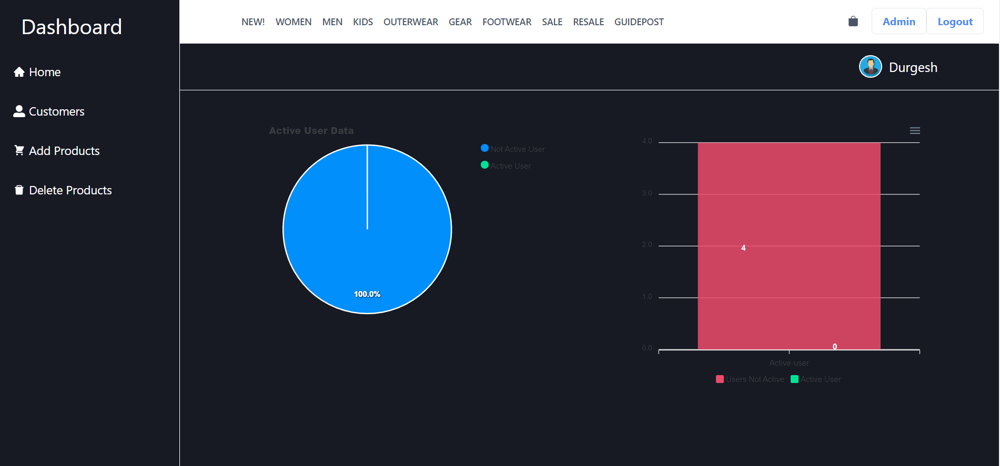

# Fashion Gallary 

<ul>
<li> Fashion Gallery is a premier online destination for men's fashion, featuring a carefully curated selection of clothing, shoes, and accessories from top brands.</li>

<li> With a focus on quality and style, Fashion Gallery offers a unique shopping experience that caters to the modern man's fashion needs, whether it's for everyday wear or special occasions. </li>

<li> From classic to contemporary, Fashion Gallery has something for every taste and budget, making it the go-to destination for men who want to look their best.</li>
</ul>

**To see the live site click the below link.**

https://fashion-gallary.vercel.app/

Tech Stack 
1. HTML,
2. CSS,
3. Reactjs,
4. Expressjs,
5. Nodejs,
6. MongoDB,
7. ChakraUI
8. Nodemailer,
9. React responsive crousel,
10. React Router dom  
  

## Features
<ul>
  <li>Signup</li>
  <li>Login</li>
    <li>Sorting</li>
  <li>Filtering products by category including Men,Women and Kids</li>
</ul>

<h1>Contributors</h1>
Durgesh Singh 
Sumit Pokhriyal  
Gautam Sonkar 
jagroshan singh 
 

## Some screenshots of the project

## Home Page

## Mens Page

## Signup Page

## Admin Page

### Thanks for reading
